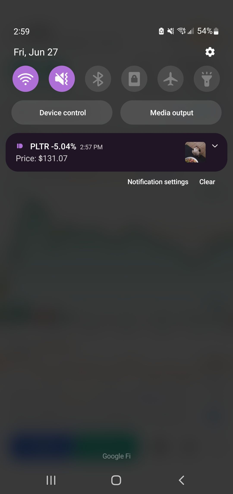

Stock Alerts (Rust, AWS Lambda, Postgres, Pushbullet, YahooFinance)

A Rust-based AWS Lambda function that tracks stock prices and sends Pushbullet notifications when significant price swings occur. It also alerts based on set crossing prices. 
Alerts and tracked stocks are stored in a supabase database.
    
Setup & Installation
The build process and deployment process is completely done via Github Actions. You can check .github/lambdabuild.yaml to see the build workflow. 

I built the project using cargo lambda build --release in MSYS2. The build process was quite problematic with a lot of dependency errors
After building just upload the build to Lambda and setup AWS Eventbridge to trigger your alerts. 
You will also need a .env file to setup the keys for pushbullet and supabase.

